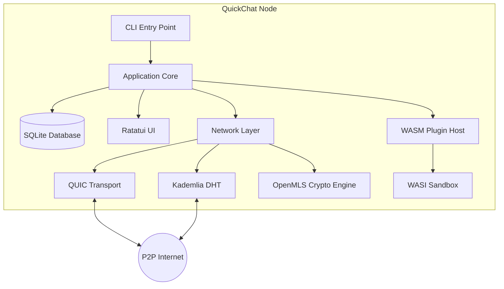
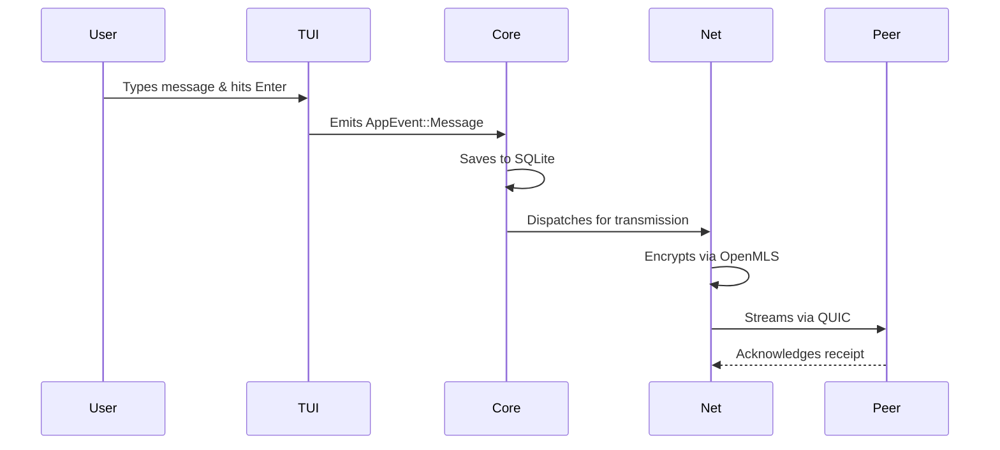

# QuickChat

<p align="center">
  <strong>The Decentralized, Secure, Peer-to-Peer Terminal Communicator</strong>
</p>

<p align="center">
  <a href="https://github.com/aaryanrwt/QuickChat/actions/workflows/ci.yml">
    
  </a>
  <a href="https://opensource.org/licenses/MIT">
    
  </a>
</p>

## 1. Overview
QuickChat enables developers to communicate securely over local networks and the internet without centralized servers, accounts, or cloud infrastructure. It solves the problem of untrusted networks and corporate data mining by keeping your conversations purely peer-to-peer, encrypted, and inside the environment developers love most: the terminal.

Whether you're pair-programming across the globe or collaborating securely within an air-gapped network, QuickChat delivers uncompromising privacy with a stunning terminal-native UX.

---

## 2. Screenshots

| Dark Theme Workspace |
| :---: |
|  |

---

## 3. Feature Overview

### Peer-to-Peer Encrypted Messaging
* **What it does:** Connects you directly to peers using QUIC streams.
* **Why it exists:** To eliminate middleman servers and data harvesting.
* **How to use it:** Type `/connect <pubkey>`.
* **Benefits:** Complete privacy, zero downtime from centralized outages, and ultra-low latency.

### OpenMLS Group Ratcheting
* **What it does:** Secures multi-party groups using Continuous Group Key Agreement (CGKA).
* **Why it exists:** To provide Perfect Forward Secrecy (PFS) in dynamic chat rooms.
* **How to use it:** Happens automatically when multiple peers join a routed chat.
* **Benefits:** Even if a key is compromised today, past and future messages remain secure.

### Global Peer Discovery (Kademlia DHT)
* **What it does:** Automatically discovers other QuickChat users globally.
* **Why it exists:** To overcome the limitations of local-network mDNS.
* **How to use it:** Handled silently in the background by `libp2p-kad`.
* **Benefits:** Connect with developers anywhere on the internet without manual port-forwarding.

### SQLite Message Persistence
* **What it does:** Saves encrypted chat history locally to your disk.
* **Why it exists:** So you don't lose your conversations when closing the terminal.
* **How to use it:** Enabled by default. History populates automatically on launch.
* **Benefits:** Full data ownership and offline reading capabilities.

### WASM Plugin Ecosystem
* **What it does:** Allows community plugins to run in a secure, sandboxed environment.
* **Why it exists:** To provide infinite extensibility without risking the core application.
* **How to use it:** Load `.wasm` modules into the `plugins/` directory.
* **Benefits:** Add features like GitHub integrations or local LLM bridging safely.

---

## 4. Version Comparison

| Feature | Version 2 | Version 3 |
|----------|-----------|-----------|
| **Networking** | LAN only | Global Internet routing |
| **Plugins** | Basic execution | WASI sandboxed, IPC host communication |
| **Discovery (DHT)** | None (mDNS only) | Kademlia DHT integration |
| **Relay** | None | `quickchat_relay` daemon for asynchronous delivery |
| **Cryptography (MLS)**| Noise_XX (1-on-1 only) | OpenMLS (Group CGKA support) |
| **Persistence (SQLite)**| Ephemeral RAM only | Persistent local SQLite database |
| **UI** | Single chat view | Multi-pane workspace (Chat, Contacts, Plugins) |
| **Commands** | Basic slash commands | Advanced `code://` pointers for live editor spawning |
| **Security** | TOFU Key Exchange | Sandboxed plugins and Perfect Forward Secrecy |

---

## 5. Installation

### Build from Source
Ensure you have the latest Rust toolchain installed.

**Linux / macOS / Windows:**
```bash
git clone https://github.com/aaryanrwt/QuickChat.git
cd QuickChat
cargo build --release
```

**Using Cargo:**
```bash
cargo install --path .
```

The executable will be placed in your cargo bin directory (e.g., `~/.cargo/bin/quickchat_cli`).

---

## 6. Quick Start

1. **Launch:** Run the executable.
   ```bash
   quickchat_cli
   ```
2. **Discover:** The DHT will automatically map local and global peers. Check your Contacts pane.
3. **Connect:** Use the `/connect` command with a peer's public key (displayed at the top of their UI).
4. **Message:** Type your message and hit `Enter`.
5. **Plugins:** Try sending a `code://file.rs:42` pointer to automatically trigger their local editor!
6. **Exit:** Type `/quit` or press `Ctrl+C`.

---

## 7. Commands

### `/help`
* **Purpose:** Displays the integrated help menu.
* **Syntax:** `/help`
* **Example:** `/help`
* **Expected output:** A modal summarizing all available keyboard shortcuts and plugin commands.

### `/connect`
* **Purpose:** Initiates an OpenMLS handshake to establish a secure P2P connection.
* **Syntax:** `/connect <public_key>`
* **Example:** `/connect 8a2f...3c`
* **Expected output:** The UI will display a successful connection status and transition to the chat view.

### `/clear`
* **Purpose:** Clears the visible terminal workspace pane.
* **Syntax:** `/clear`
* **Example:** `/clear`
* **Expected output:** The screen clears. (Your SQLite history remains intact on disk).

### `/ping`
* **Purpose:** Evaluates the WASM plugin sandbox functionality.
* **Syntax:** `/ping`
* **Example:** `/ping`
* **Expected output:** The plugin intercepts the command and returns `Pong!`.

### `/quit`
* **Purpose:** Safely flushes the database, closes network streams, and exits.
* **Syntax:** `/quit`
* **Example:** `/quit`
* **Expected output:** Terminal returns to the standard shell prompt.

---

## 8. Architecture

QuickChat utilizes an event-driven, highly modular architecture to separate networking, UI, and plugin execution. The core application logic coordinates these systems using a highly concurrent asynchronous event bus.

### Component Diagram



### Message Flow Sequence



---

## 9. Project Structure

The monorepo is meticulously split into logical crates:

* **`quickchat_cli`**: The binary executable and command-line argument parser.
* **`quickchat_core`**: The central application state, SQLite database logic, and OpenMLS cryptography engine.
* **`quickchat_net`**: The P2P networking layer handling QUIC transport.
* **`quickchat_dht`**: The Kademlia-based global peer routing and discovery module.
* **`quickchat_relay`**: An optional, headless daemon for asynchronous store-and-forward message delivery.
* **`quickchat_tui`**: The interactive terminal user interface built with `ratatui` and `crossterm`.
* **`quickchat_plugin_host`**: The `wasmtime` runtime that securely loads and executes third-party `.wasm` plugins.
* **`quickchat_plugin_sdk`**: FFI bindings and macros for community developers building QuickChat extensions.
* **`quickchat_types`**: Shared Protocol Buffer definitions used across network and WASM boundaries.

---

## 10. Security

* **Messaging Layer Security (MLS):** We utilize the `MLS_128_DHKEMX25519_CHACHA20POLY1305_SHA256_Ed25519` ciphersuite. This provides state-of-the-art Authenticated Encryption with Associated Data (AEAD) and Perfect Forward Secrecy.
* **Plugin Sandbox:** Third-party plugins execute inside a restricted WebAssembly System Interface (WASI). They are isolated from the host OS network stack and filesystem, communicating strictly via structured Inter-Process Communication (IPC).
* **Decentralized Discovery:** The Kademlia DHT prevents any central server from mapping the social graph of who is communicating with whom.
* **Local Storage:** Your chat histories (`quickchat.db`) are saved strictly to your local SSD. We have zero access to your data.

---

## 11. Performance

* **QUIC Multiplexing:** Messages and file transfers occur over heavily multiplexed UDP streams, eliminating the head-of-line blocking associated with traditional TCP sockets.
* **Asynchronous I/O:** Powered entirely by `tokio`, the application can handle thousands of concurrent background DHT queries without blocking the 60 FPS UI render thread.
* **Statically Linked:** The entire application compiles down to a single binary with no bulky runtime requirements.

---

## 12. Contributing

We welcome community contributions! To get started:
1. Ensure your code passes all formatting and linting checks:
   ```bash
   cargo fmt --all
   cargo clippy --workspace --all-targets --all-features -- -D warnings
   ```
2. Verify all tests pass locally:
   ```bash
   cargo test --workspace
   ```
3. Submit a Pull Request with a clear description of the feature or bug fix. All PRs must pass the GitHub Actions CI pipeline.

---

## 13. Roadmap

Upcoming features planned for the **Version 4** lifecycle:
* **Asynchronous Group Joins:** Upgrading the `quickchat_relay` to temporarily hold encrypted MLS KeyPackages to support seamless offline group invitations.
* **Encrypted SQLite:** Integrating SQLCipher to encrypt the local `quickchat.db` at rest.
* **Plugin Registry:** A centralized index for discovering and installing community WASM plugins directly from the TUI.
* **Automated CI/CD Hooks:** Native integration to pipe GitHub Actions build results directly into QuickChat channels.
