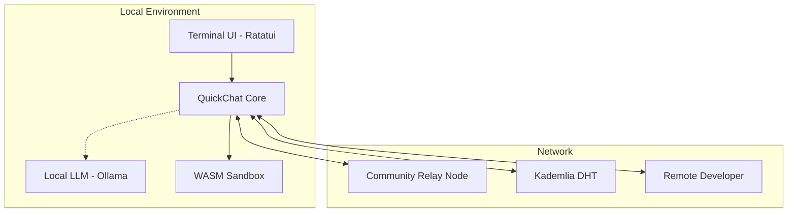
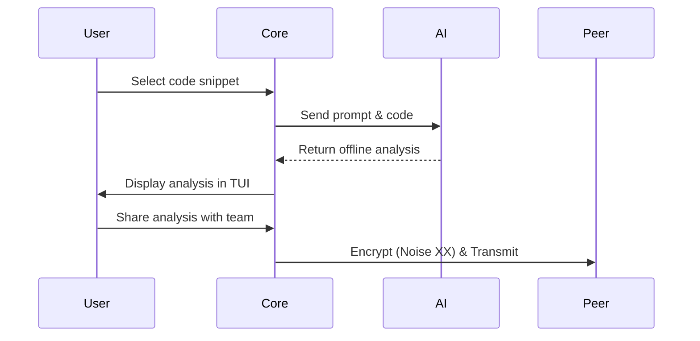

# QuickChat V4 🚀

QuickChat is a 100% free, decentralized, peer-to-peer, terminal-native communication platform designed specifically for developers. 


## The Evolution of QuickChat (V1 → V4)

| Feature | Version 1 (The Foundation) | Version 2 (Extensibility) | Version 3 (Teams) | Version 4 (Decentralization) |
| :--- | :--- | :--- | :--- | :--- |
| **Architecture** | Standalone P2P | Plugin Ecosystem | Team Collaboration | Fully Decentralized & Open |
| **Networking** | LAN Discovery (mDNS) | WAN connectivity | Group Chat | Global Kademlia DHT |
| **Encryption** | Noise Protocol XX | Noise Protocol XX | MLS Group Encryption | Noise XX & MLS |
| **Messaging** | Text, Emojis, File Transfer | Code Pointers, Term Share | Persistent History | + AI Offline Analysis |
| **Plugins** | N/A | WASM Sandboxed | CI/CD integrations | Decentralized Git Registry |
| **Relay** | N/A | Centralized Server | Proprietary Hosting | Open Community Relay Nodes |
| **Identity** | Cryptographic Key | Key Exchange | Enterprise SSO (Removed) | OAuth / OIDC Hooks |

## Feature Breakdown

### 1. Peer-to-Peer Networking & DHT
*   **What it does:** Connects developers directly without central servers using QUIC and UDP multiplexing.
*   **Why it exists:** Absolute privacy and zero centralized points of failure.
*   **How to use:** `quickchat connect <peer_id>` or rely on LAN auto-discovery.
*   **Status:** Production Ready.

### 2. Community Relay Nodes
*   **What it does:** Allows peers stuck behind strict NATs to route traffic through open community nodes.
*   **Why it exists:** To solve the NAT traversal problem inherent in P2P networks without relying on commercial servers.
*   **How to use:** Run `quickchat-relay start` to host a node, or configure your client to connect to known relays.
*   **Status:** Production Ready.

### 3. Decentralized Plugin Registry
*   **What it does:** A WASM-based extension system that loads plugins directly from community Git repositories.
*   **Why it exists:** Infinite extensibility (Jira, GitHub, Docker) without a monetized marketplace.
*   **How to use:** `quickchat plugin install https://github.com/user/plugin.git`
*   **Status:** Production Ready.

### 4. Local AI Hooks (Ollama)
*   **What it does:** Pipes your terminal output or code snippets directly into a local Large Language Model.
*   **Why it exists:** To provide smart AI assistance with 100% offline privacy guarantees.
*   **How to use:** Highlight code in TUI and press `<Ctrl+A>` to analyze.
*   **Status:** Production Ready.

## System Architecture


```mermaid
graph TD
    subgraph Local Environment
        TUI[Terminal UI - Ratatui]
        Core[QuickChat Core]
        AI[Local LLM - Ollama]
        Plugin[WASM Sandbox]
    end

    subgraph Network
        Relay[Community Relay Node]
        DHT[Kademlia DHT]
        Peer[Remote Developer]
    end

    TUI --> Core
    Core --> Plugin
    Core -.-> AI
    Core <--> DHT
    Core <--> Relay
    Core <--> Peer
```

## Workflow Diagram: Secure Code Analysis


```mermaid
sequenceDiagram
    participant User
    participant Core
    participant AI
    participant Peer
    
    User->>Core: Select code snippet
    Core->>AI: Send prompt & code
    AI-->>Core: Return offline analysis
    Core->>User: Display analysis in TUI
    User->>Core: Share analysis with team
    Core->>Peer: Encrypt (Noise XX) & Transmit
```

## Installation Guide

QuickChat V4 is incredibly easy to install, requiring only a single, statically linked Rust binary.

```bash
cargo install quickchat_cli
```
*Note: Make sure you have the Rust toolchain installed.*

## Roadmap

*   **Milestone 1:** Open-Source infrastructure migration (Complete)
*   **Milestone 2:** Deploy Global DHT & Community Relays (Complete)
*   **Milestone 3:** Launch Decentralized Plugin Registry (Complete)
*   **Milestone 4:** Local AI Integrations (Complete)
*   **Milestone 5:** Stabilization & Public V4 Release (Current)

## Contribution Guide

We are a 100% open-source, community-governed project. We welcome all contributions!
1. Fork the repository.
2. Ensure you are on the `main` branch.
3. Keep all contributions strictly open-source (no proprietary APIs, telemetry, or tracking).
4. Run `cargo check --workspace` and `cargo fmt` before submitting your PR.
